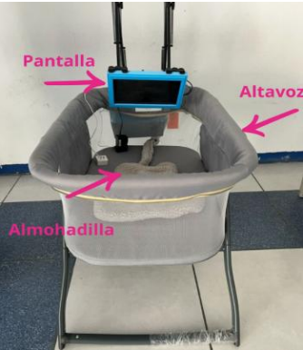
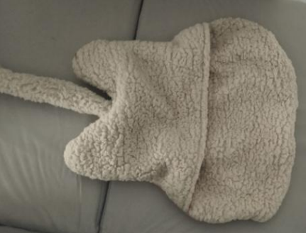

# Dispositivo de Estimulación Sensorial para Bebés Prematuros

Este repositorio contiene toda la documentación, el software y los archivos de diseño de hardware para el "Dispositivo de Estimulación Temprana para Bebés Prematuros", un proyecto desarrollado en la **Universidad Politécnica de Chiapas** en colaboración con el **Hospital de Especialidades Pediátricas**.

El sistema integra estímulos auditivos, táctiles y visuales de forma controlada para apoyar el desarrollo neurológico, motor y emocional de los bebés nacidos prematuramente, basándose en principios de neurociencia del desarrollo y el método Rood.

## 📄 Artículo del Proyecto

El artículo que detalla el marco teórico, el diseño y la metodología de este sistema fue publicado en la revista **"Tecnología y Ciencia Aplicada"** (ISSN: 2992-8338).

Esta es la revista académica semestral, arbitrada por pares, del Tecnológico Nacional de México/Centro Nacional de Investigación y Desarrollo Tecnológico (TecNM/CENIDET).

* **Publicación:** Vol. 8 / Num. 1, Enero - Junio 2025

Puedes consultar una copia del manuscrito aceptado en la carpeta de documentación del repositorio:

* **[Consulta el artículo aquí](./docs/2025_Articulo_Estimulacion_Prematuros_TyCA.pdf)**

---

## 🌟 Características Principales

* **Módulo Auditivo:** Emite sonidos suaves (música clásica, voces parentales) a niveles seguros para el neonato.
* **Módulo Táctil:** Proporciona vibraciones suaves a través de almohadillas ajustables para promover respuestas neuromotoras.
* **Módulo Visual:** Utiliza luces y formas simples en movimiento en intervalos breves para apoyar el desarrollo visual.
* **Control Centralizado:** Todo el sistema es controlado por una **Raspberry Pi 4**, con una interfaz gráfica desarrollada en Python (Tkinter).
* **Diseño Físico Abierto:** Incluye los archivos de diseño `.STL` para la carcasa impresa en 3D, permitiendo su replicación.

## 📂 Contenido del Repositorio

* **/hardware**: Contiene los archivos `.STL` para la impresión 3D de la carcasa del dispositivo.
* **/software**: Incluye el script de Python (`front_3.py`) que controla la interfaz de usuario y los actuadores (GPIO de la Raspberry Pi).
* **/docs**: Contiene el artículo principal publicado (`2025_Articulo_Estimulacion_Prematuros_TyCA.pdf.pdf`) y otra documentación de soporte.

## ⚙️ Requisitos de Software

Las librerías de Python necesarias para ejecutar la interfaz se listan en el archivo `requirements.txt`.

-   Python 3
-   Tkinter (generalmente incluido con Python)
-   Pillow (PIL)
-   RPi.GPIO
-   playsound

## 📸 Vistas del Hardware

  
   
  <em>Diseño final del dispositivo (render 3D).</em>

  
   
  <em>Colchón de estimulación con motores vibradores (módulo táctil).</em>

## 📄 Licencia

Este proyecto se distribuye bajo la Licencia MIT. Consulta el archivo `LICENSE` para más detalles.
